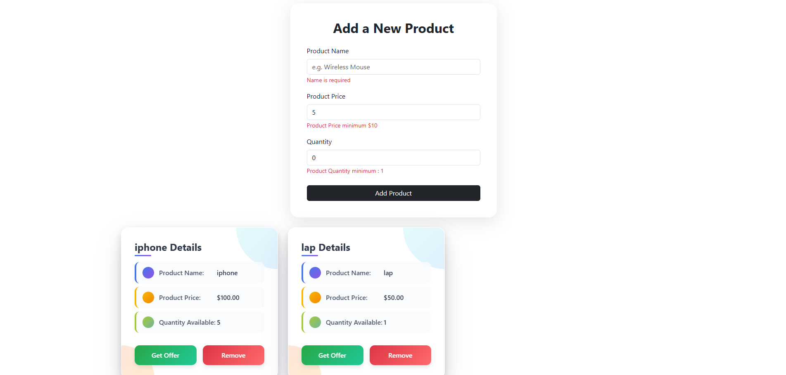

# Add Product Using Angular

A modern web application for managing product inventory with a clean user interface.

## Features

- Add New Products
- Validation Form
- Product Cards
- Remove Products
- Get Offer Option
- Duplicate Prevention

Application Structure
The application consists of:

Product Entry Form - For adding new products
Product Display Section - Shows all products as individual cards
Action Buttons - "Get Offer" and "Remove" options for each product

Installation and Setup

Clone the repository
git clone https://github.com/AliMohaamed/add-product-angular-day-4.git

Install dependencies
npm install

Start the development server
npm start

Open your browser and navigate to http://localhost:4200

Future Enhancements

Product categories and filtering
Product search functionality
Inventory analytics dashboard
User authentication and permissions
